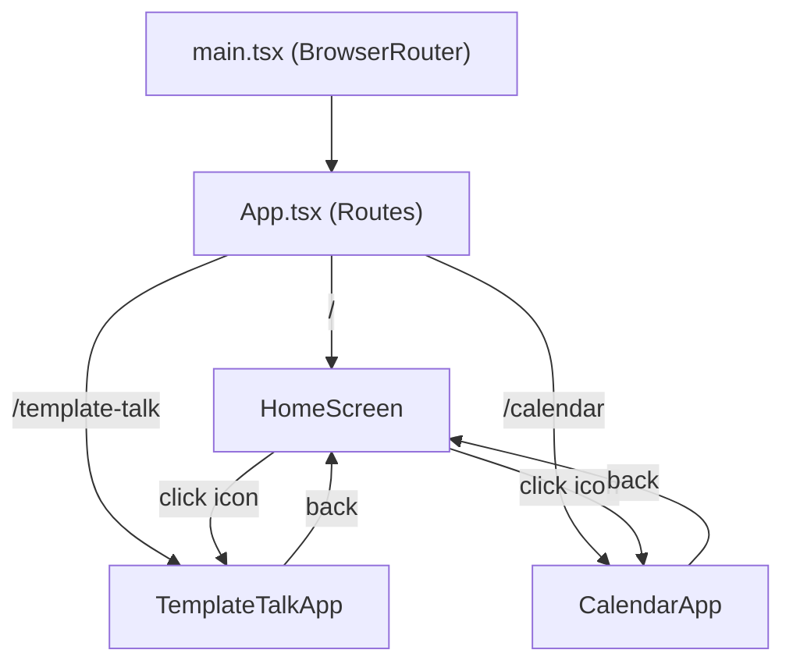

# Rose's Toolbox -- Project Transformation Plan

## Current State

Single-page React + TypeScript + Tailwind + Vite app with no routing. All template talk logic lives in `App.tsx` and `src/components/`. Data is stored in IndexedDB via `idb`.

## Architecture Overview




## New Folder Structure

```
src/
  main.tsx                          # Add BrowserRouter
  App.tsx                           # Route definitions only
  index.css                         # Global styles + home screen styles
  types/
    index.ts                        # Add CalendarEvent type
  components/
    Toast.tsx                       # Shared (stays)
    HomeScreen.tsx                  # NEW: iPhone-like home screen
  apps/
    template-talk/
      TemplateTalkApp.tsx           # Extracted from current App.tsx
      components/                   # Move existing: AddButton, Card, TemplateForm, VariableForm
      hooks/                        # Move existing: useTemplates
      utils/                        # Move existing: variables
    calendar/
      CalendarApp.tsx               # NEW
      components/
        MonthView.tsx               # Monthly grid
        EventForm.tsx               # Add/edit event modal
        DayDetail.tsx               # Show events for a selected day
      hooks/
        useCalendarEvents.ts        # IndexedDB CRUD for events
```

## Key Changes

### 1. Add react-router-dom

Install `react-router-dom`. Wrap the app in `BrowserRouter` in [main.tsx](src/main.tsx), and turn [App.tsx](src/App.tsx) into a route table:

- `/` --> `HomeScreen`
- `/template-talk` --> `TemplateTalkApp`
- `/calendar` --> `CalendarApp`

### 2. Rename Project

- [package.json](package.json): `name` --> `"roses-toolbox"`
- [index.html](index.html): `<title>` --> `"Rose's Toolbox"`

### 3. iPhone-like Home Screen (`HomeScreen.tsx`)

Design a home screen mimicking an iPhone springboard:

- **Background**: Soft gradient wallpaper (e.g. iOS-style blue/purple mesh gradient)
- **Status bar**: Clock display at top
- **App grid**: Centered grid of rounded-square app icons with labels
  - "模板话术" icon -- document/lightning themed, green accent
  - "日历" icon -- calendar themed, red accent
- **Dock**: Frosted-glass bar at bottom (currently just decorative)
- Each icon uses `useNavigate()` to route to the corresponding app
- CSS animations for a subtle scale/fade when tapping an icon

### 4. Move Template Talk to Sub-Module

Move existing files into `src/apps/template-talk/`:


| Current Path                      | New Path                                             |
| --------------------------------- | ---------------------------------------------------- |
| `src/App.tsx` (logic)             | `src/apps/template-talk/TemplateTalkApp.tsx`         |
| `src/components/AddButton.tsx`    | `src/apps/template-talk/components/AddButton.tsx`    |
| `src/components/Card.tsx`         | `src/apps/template-talk/components/Card.tsx`         |
| `src/components/TemplateForm.tsx` | `src/apps/template-talk/components/TemplateForm.tsx` |
| `src/components/VariableForm.tsx` | `src/apps/template-talk/components/VariableForm.tsx` |
| `src/hooks/useTemplates.ts`       | `src/apps/template-talk/hooks/useTemplates.ts`       |
| `src/utils/variables.ts`          | `src/apps/template-talk/utils/variables.ts`          |


`TemplateTalkApp.tsx` will be a refactored version of the current `App.tsx` with:

- A back button to return to home screen (`useNavigate()`)
- All existing functionality preserved
- Updated import paths

### 5. New Calendar App

**Data model** (add to [types/index.ts](src/types/index.ts)):

```typescript
export interface CalendarEvent {
  id: string;
  title: string;
  date: string;       // YYYY-MM-DD
  startTime?: string;  // HH:mm
  endTime?: string;    // HH:mm
  description?: string;
  color: string;
  createdAt: number;
  updatedAt: number;
}
```

**IndexedDB**: New store `calendar-events` in a separate DB `roses-toolbox-calendar-db`.

**UI**:

- **MonthView**: 7-column grid showing the current month, with dots/indicators for days that have events. Navigation arrows to switch months.
- **DayDetail**: Clicking a day shows a side panel/modal listing that day's events with add button.
- **EventForm**: Modal to add/edit events (title, date, time range, description, color picker).
- Back button to return to home screen.
- Consistent styling with the template talk app (Tailwind, rounded corners, shadows).

### 6. Shared Components

- `Toast.tsx` stays in `src/components/` as it's used by both apps
- `HomeScreen.tsx` is the new root-level page component

## Dependencies to Add

- `react-router-dom` (latest)

